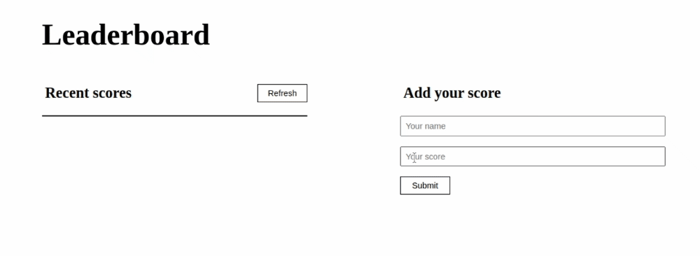

# To Do List

> Sending and receiving data from/to the Leaderboard API
> The leaderboard website displays scores submitted by different players. All data is preserved thanks to the external Leaderboard API service.

## Built With

- HTML & CSS
- JavaScript
- Webpack
- REST API

## Live Demo

[Live Demo Link](https://shoirata.github.io/leaderboard/)

## Getting Started

To get a local copy up and running follow these simple example steps.

- go to the directory that you want to clone the repository in.
- right click and choose Git Bash here.
- type "git clone https://github.com/ShoiraTa/leaderboard.git".
- run `npm install` to install all the dependencies
- Run `npm start` to bundle the files in the src folder

or

- Go to the dist folder and open index.html

## Authors

👤 **Shoira**

- GitHub: [@githubhandle](linkedin.com/in/shoira-tashpulatova-bab4a7122)
- Twitter: [@twitterhandle](https://twitter.com/Shoira03)
- LinkedIn: [LinkedIn](https://www.linkedin.com/feed/)

## 🤝 Contributing

Contributions, issues, and feature requests are welcome!

Feel free to check the [issues page](../../issues/).

## Show your support

Give a ⭐️ if you like this project!

## Acknowledgments

- Hat tip to anyone whose code was used
- Inspiration
- etc

## 📝 License

This project is [MIT](./MIT.md) licensed.
